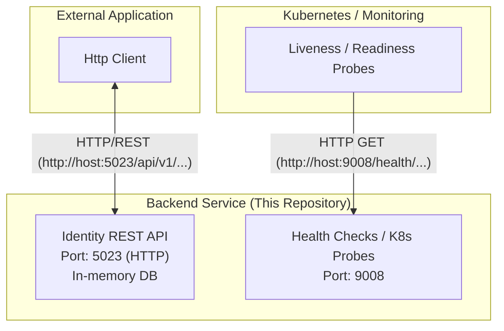

# Identity Web API (POC)

A Proof-of-Concept Identity Management REST API built with .NET 9. This service handles user authentication, account management, and token generation.

## Architecture

The system enables external clients (like the VS Code MCP Agent) to authenticate and interact with backend services.



### Components
- **Core**: Domain entities and interfaces (`ae-poc-identity-core`).
- **Storage**: EF Core implementation using SQLite (`ae-poc-identity-storage`).
- **Services**: Business logic for accounts and master data (`ae-poc-identity-services`).
- **Web API**: REST controllers and entry point (`ae-poc-identity-webapi`).

## Technologies
- **Framework**: .NET 9
- **Database**: SQLite (In-Memory for POC)
- **Logging**: Serilog
- **Testing**: xUnit, FluentAssertions

## Getting Started

### Prerequisites
- .NET 9 SDK installed.

### Running the Application
1. Navigate to the Web API directory:
   ```bash
   cd ae-poc-identity-webapi
   ```
2. Run the application:
   ```bash
   dotnet run
   ```
   The API will start on the ports configured in `launchSettings.json` (usually `http://localhost:5023`).

### Running with Docker
You can run the application directly using Docker Compose:
```bash
docker-compose up -d --build
```
This will start the API container mapped to:
- **API**: `http://localhost:5023`
- **Health Checks**: `http://localhost:9008`

### Health Checks
The application exposes generic health check endpoints on a dedicated port (default: 9008, diagram above shows architecture target 9008).

- **Liveness**: `GET http://localhost:9008/health/live`
  - Checks if the application process is running.
- **Readiness**: `GET http://localhost:9008/health/ready`
  - Checks if the application can connect to the database.

> **Note**: The health check port is configured in `appsettings.json` under `Health:Port`.

## Configuration

The application uses `appsettings.json` for configuration.

### Logging (Serilog)
Logging is configured via the `Serilog` section. By default, it writes to the Console.
```json
"Serilog": {
  "MinimumLevel": "Information",
  "WriteTo": [ { "Name": "Console" } ]
}
```

### Health Check Settings
```json
"Health": {
  "Enabled": true,
  "Port": 9008,
  "LivePath": "/health/live",
  "ReadyPath": "/health/ready"
}
```

## Testing

Run unit and integration tests using the .NET CLI:
```bash
dotnet test
```

> **Note**: Integration tests are configured to run sequentially to avoid conflicts with the static Logger configuration.
